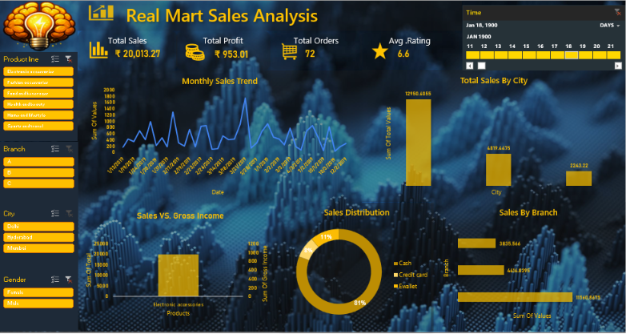

# 🛒 Real Mart Sales Analysis – Excel

Interactive sales analysis dashboard developed using Microsoft Excel to analyze sales, profit, orders, ratings, products, cities, branches, and payment methods.

## 🛠️ Tools & Technologies

- Microsoft Excel
- Pivot Tables
- Pivot Charts
- Slicers
- Data Analysis
- Data Visualization

## 📊 Dashboard Features

- Total Sales
- Total Profit
- Total Orders
- Average Rating
- Monthly Sales Trend
- Sales by City
- Sales by Branch
- Sales Distribution
- Sales vs Gross Income
- Product Analysis
- Interactive Filters

## 🖼️ Dashboard Preview

## 🎯 Objective

To analyze retail sales performance and identify trends across products, cities, branches, customers, and payment methods using interactive Excel visualizations.

## 📂 Project File

The Excel workbook contains the underlying data, pivot tables, analysis, and interactive dashboard.
